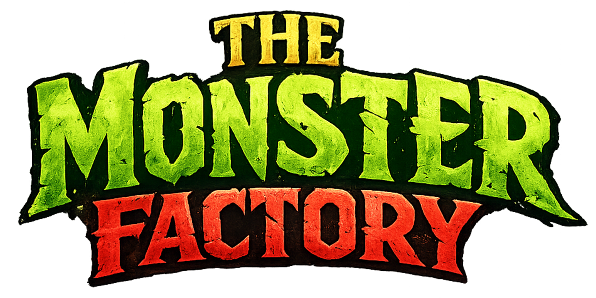

  

# MonsterFactory

A modular, lore‑rich creature‑building engine designed for scalable web deployment and premium fantasy presentation.

## ✨ Overview

MonsterFactory is a browser‑based tool for generating, editing, and exporting custom fantasy creatures. It blends a premium design system, dieselpunk‑fantasy branding, and a robust Node/Express backend to deliver a polished, production‑ready experience.

## 🚀 Features

- Modular architecture — clean separation of UI, logic, and server layers
- Dynamic creature rendering — metadata‑driven templates with server‑side rendering
- Export pipeline — reliable, race‑condition‑free export system
- Design system — unified typography, spacing, and component structure
- Security middleware — regex honeypot traps and noise‑filtering modules
- Fantasy‑themed logging — Mortal Engines–inspired subsystem vocabulary

## 🧱 Tech Stack

- Node.js + Express for backend routing and static serving
- Vanilla JS modules for orchestrated client‑side initialization
- CSS design tokens for scalable styling
- Server‑side rendering for gallery and creature pages
- TrueNAS SCALE deployment for persistent logs and container stability
